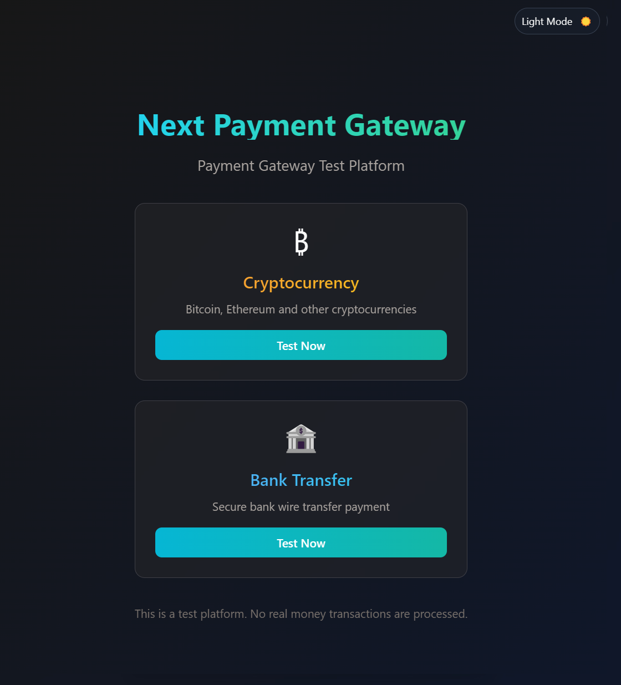
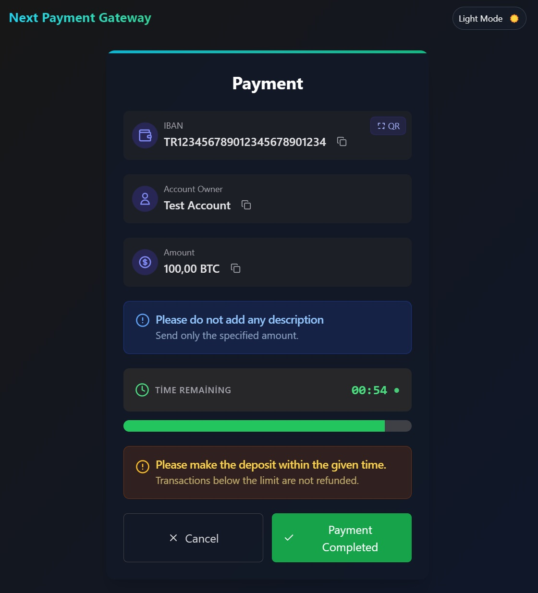
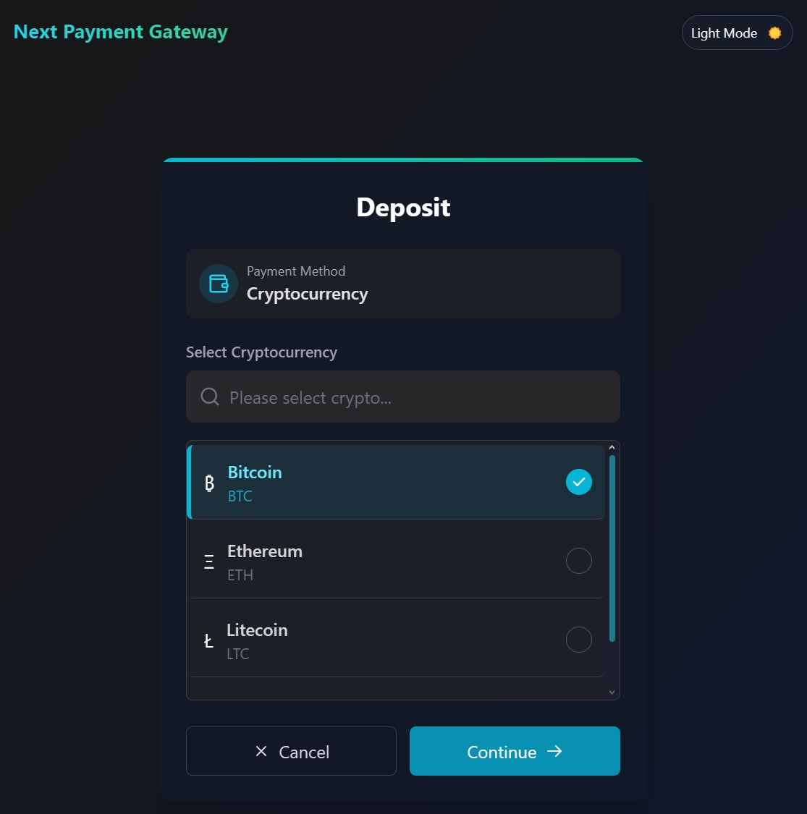

# 🚀 Next Payment Gateway

A modern, secure frontend solution for payment processing built with Next.js 14. Features multiple payment methods including cryptocurrency and bank transfers with a beautiful, responsive UI and comprehensive test platform.

> **🎯 Perfect for developers** who need a ready-to-use payment gateway frontend with modern design and comprehensive functionality.

[](https://nextjs.org/)
[](https://www.typescriptlang.org/)
[](https://tailwindcss.com/)

---

## Features Implemented

- **Multiple Payment Methods**: Cryptocurrency and Bank Transfer support
- **Test Platform**: Interactive homepage with test buttons for each payment method
- **Real-time Transaction Processing**: Dynamic transaction creation and status tracking
- **Responsive Design**: Modern UI with dark/light theme support
- **JSON-based Data**: Flexible data structure for easy deployment and testing
- **TypeScript**: Full type safety throughout the application
- **Tailwind CSS**: Modern, utility-first styling approach
- **Bank Selection**: Interactive bank selection with 6 Turkish banks
- **Cryptocurrency Selection**: Support for Bitcoin, Ethereum, Litecoin, and Tether (TRC20)
- **Dynamic Transaction Generation**: Creates unique test transactions with persistent timers
- **Cyan-Teal-Emerald Theme**: Modern gradient color scheme throughout the application
- **Dark/Light Mode Toggle**: Seamless theme switching with persistent preferences
- **Responsive Icons**: Cryptocurrency icons with theme-aware colors (Bitcoin white in dark mode)
- **Real-time Timer**: Persistent countdown timer that survives page refreshes
- **Copy to Clipboard**: One-click copy functionality for addresses and amounts
- **QR Code Generation**: Dynamic QR codes for wallet addresses and payment details

---

## Tech Stack

- **Frontend**: Next.js 14 (App Router)
- **Language**: TypeScript
- **Styling**: Tailwind CSS
- **Icons**: Lucide React
- **Data**: JSON-based (easily replaceable with real API)
- **Deployment**: Vercel-ready


---

## Project Structure

```
next-payment-gateway/
├── public/
│   └── test-data.json          # Test data for development
├── src/
│   ├── app/                    # Next.js App Router pages
│   │   ├── cancel/            # Payment cancellation page
│   │   ├── thankyou/          # Payment success page
│   │   ├── timeout/           # Payment timeout page
│   │   ├── transaction/       # Transaction pages
│   │   │   ├── [id]/         # Transaction selection
│   │   │   └── details/[id]/ # Payment details
│   │   └── page.tsx          # Homepage with test buttons
│   ├── components/           # Reusable UI components
│   ├── config/              # Configuration files
│   │   └── api.ts          # API configuration
│   ├── lib/                # Utility functions
│   └── services/           # API service layer
│       └── api.ts         # API service functions
└── README.md
```

---

## Payment Flow

### 1. Homepage Test Platform
- Two payment method buttons: Cryptocurrency and Bank Transfer
- Each button generates a unique test transaction ID
- Redirects to transaction processing page

### 2. Transaction Processing
```
START
├── Generate test transaction ID (test_[method]_[timestamp])
├── Load transaction data from JSON or create dynamic transaction
├── Check payment method
│   ├── Bank Transfer (paymentMethod=2) → Show bank selection (6 Turkish banks)
│   ├── Cryptocurrency (paymentMethod=3) → Show crypto selection (BTC, ETH, LTC, USDT)
│   └── Other → Show general payment methods
├── User selects specific option (bank or cryptocurrency)
├── Create deposit via API
└── Redirect to payment details page
```

### 3. Payment Details
- Display payment information (account details, amount, timer)
- Real-time countdown timer (configurable via JSON)
- "Payment Completed" and "Cancel" buttons
- Automatic redirect on timeout

### 4. Payment Completion
```
Payment Completed → Check localStorage for redirect URL
├── URL exists → Redirect to custom URL
└── No URL → Redirect to thank you page

Payment Cancelled → Show confirmation dialog
├── Confirmed → Cancel transaction → Redirect to cancel page
└── Cancelled → Close dialog

Timeout → Automatic redirect to timeout page
```

---

## Screenshots

### 🏠 Homepage - Dark Mode


**Homepage Features:**
- 🎨 **Modern Gradient Title**: Cyan-teal-emerald color transition
- ₿ **Bitcoin Icon**: White in dark mode, orange in light mode
- 🌙 **Theme Toggle**: Light/Dark mode switch in the top right
- 💳 **Two Payment Methods**: Cryptocurrency and Bank Transfer
- 🎯 **Test Buttons**: "Test Now" button for each method
- 📱 **Responsive Design**: Perfect appearance on all devices

### 💰 Cryptocurrency Selection


**Crypto Selection Page Features:**
- 🔍 **Search Box**: "Please select crypto..." placeholder
- ✅ **Bitcoin Selected**: Blue check mark indicator
- 📋 **Crypto List**: Bitcoin, Ethereum, Litecoin options
- ₿ **White Bitcoin Icon**: Optimized for dark mode
- 🎨 **Cyan Border**: Blue border for selected item
- ⚡ **Quick Selection**: One-click cryptocurrency selection

### 💳 Payment Details


**Payment Details Page Features:**
- 🏦 **IBAN Info**: TR123456789012345678901234 (with copy button)
- 👤 **Account Owner**: Test Account (with copy button)
- 💵 **Amount**: 100.00 BTC (with copy button)
- 📱 **QR Code**: QR button in the top right
- ⏰ **Countdown Timer**: 00:54 countdown (green)
- 📊 **Progress Bar**: Green bar showing remaining time
- ⚠️ **Warning Messages**: Blue info and brown warning boxes
- ✅ **Action Buttons**: Cancel and Payment Completed

### 🎯 Key Features Showcase
- **🌙 Theme Support**: Seamless dark/light mode switching
- **₿ Bitcoin Icon Optimization**: White in dark mode, orange in light mode
- **📱 Responsive Design**: Perfect on desktop, tablet, and mobile
- **🎨 Modern UI**: Clean interface with smooth animations
- **⚡ Real-time Updates**: Live countdown and instant feedback
- **📋 Copy to Clipboard**: One-click copy for all important data
- **🔄 Persistent Timer**: Timer survives page refreshes

---

## Getting Started

### Installation
```bash
npm install
```

### Development
```bash
npm run dev
```
Server runs on http://localhost:3001 (or next available port)

## Configuration

## Development vs Production

### Development Mode
- Uses `public/test-data.json` for all data
- No real API calls required
- Perfect for testing and development

### Production Mode
Simply update the API service URLs:
```typescript
// Development
const response = await fetch('/test-data.json');

// Production
const response = await fetch('https://your-api.com/transaction/' + id);
```

### Test Data Structure
The project includes comprehensive test data:
- **Payment Methods**: Cryptocurrency and Bank Transfer definitions
- **Banks**: 6 Turkish banks (Akbank, Garanti BBVA, İş Bank, Ziraat, Yapı Kredi, VakıfBank)
- **Cryptocurrencies**: 4 options (Bitcoin, Ethereum, Litecoin, Tether TRC20)
- **Account Types**: Personal, Business, Enterprise accounts
- **Dynamic Transactions**: Auto-generated from button clicks with persistent timers

---

## Features

### ✅ Implemented
- [x] Multi-payment method support
- [x] Responsive design with theme support
- [x] Real-time transaction processing
- [x] JSON-based configuration
- [x] TypeScript integration
- [x] Test platform with interactive buttons
- [x] Transaction timeout handling
- [x] Payment cancellation flow

### 🚀 Ready for Production
- [x] Environment variable configuration
- [x] API service abstraction
- [x] Error handling
- [x] Loading states
- [x] Mobile-responsive design

---

## Contributing

1. Fork the repository
2. Create your feature branch (`git checkout -b feature/amazing-feature`)
3. Commit your changes (`git commit -m 'Add some amazing feature'`)
4. Push to the branch (`git push origin feature/amazing-feature`)
5. Open a Pull Request


---

## Support

For support, email me@kemalakcil.com or create an issue on GitHub.
